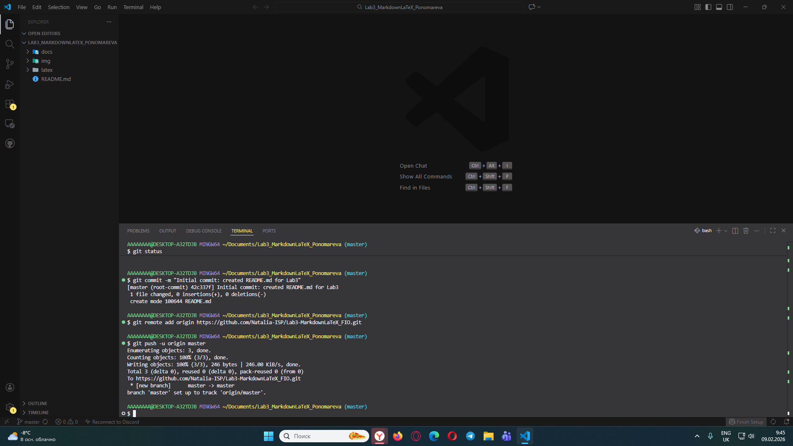

# Лабораторная работа №3. Работа с Markdown-разметкой и базовое использование LaTeX в документации проекта

Целью данной лабораторной работы было изучение основ синтаксиса и возможностей языка разметки Markdown. Мы исследовали различные способы форматирования текста, создания списков и таблиц, а также освоили принципы встраивания изображений и ссылок.

### Содержание

[Начало](#1)
[Содержание](#5)
[Примеры возможностей]((#12))
[Конец](#72)

Примеры следующих возможностей:
### 1.
# h1
## h2
### h3
### 2.
---
### 3.
**Добро** ***пожаловать*** ~~к нам~~! 
### 4.
+ 1
+ 2
+ 3
1. a
2. b
3. c

Вложенный:
1. a
    + fff
### 5.
>Цитата
### 6.
```python
print("hello!)
```
### 7.
|слово|язык|перевод|
|:-|:-:|-:|
|hi|english|привет|

### 8.



### 9.

[Начало](#1)
[youtube](https://www.youtube.com/)
### 10.
- [ ] Task 1
- [x] Task 2
### 11.
мяу[^1]
### 12.
>[!NOTE]
> заметка

>[!TIP]
> совет

>[!WARNING]
> предупреждение
### 13.
Площадь круга: $S = \pi r^2$
### 14.
$$
\sum_{i=1}^n i = \frac{n(n+1)}{2}
$$

[^1]: meeeeeow
